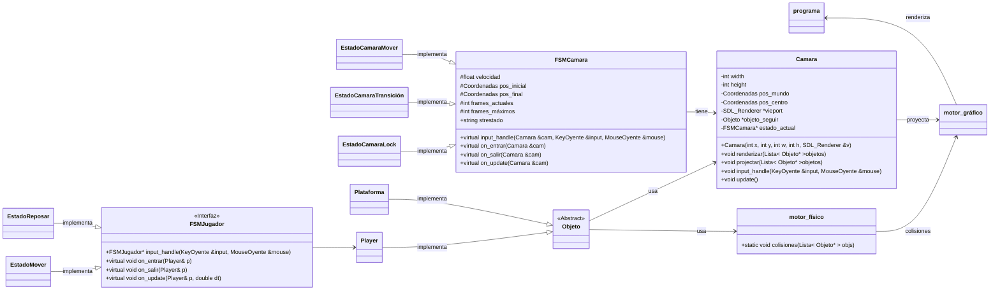

Para ver el diagrama se ocupa la extensión **Markdown Preview mermaid support**

```mermaid
classDiagram
direction LR

programa <-- motor_gráfico : renderiza

class Objeto
<<Abstract>> Objeto


Plataforma --|> Objeto : implementa
Player --|> Objeto : implementa

class FSMJugador
<<Interfaz>> FSMJugador
FSMJugador: +FSMJugador* input_handle(KeyOyente &input, MouseOyente &mouse)
FSMJugador: +virtual void on_entrar(Player& p)
FSMJugador: +virtual void on_salir(Player& p)
FSMJugador: +virtual void on_update(Player& p, double dt)
FSMJugador-->Player

class EstadoReposar
EstadoReposar --|> FSMJugador : implementa

class EstadoMover
EstadoMover--|> FSMJugador: implementa

class Camara
Camara:+Camara(int x, int y, int w, int h, SDL_Renderer &v)
Camara:+void renderizar(Lista< Objeto* >objetos)
Camara:+void projectar(Lista< Objeto* >objetos)
Camara:+void input_handle(KeyOyente &input, MouseOyente &mouse)
Camara:+void update()
Camara:-int width
Camara:-int height
Camara:-Coordenadas pos_mundo
Camara:-Coordenadas pos_centro
Camara:-SDL_Renderer *vieport
Camara:-Objeto *objeto_seguir
Camara:-FSMCamara* estado_actual

class FSMCamara
FSMCamara:#float velocidad
FSMCamara:#Coordenadas pos_inicial
FSMCamara:#Coordenadas pos_final
FSMCamara:#int frames_actuales
FSMCamara:#int frames_máximos
FSMCamara:+string strestado
FSMCamara:+virtual input_handle(Camara &cam, KeyOyente &input, MouseOyente &mouse)
FSMCamara:+virtual on_entrar(Camara &cam)
FSMCamara:+virtual on_salir(Camara &cam)
FSMCamara:+virtual on_update(Camara &cam)

class EstadoCamaraMover
class EstadoCamaraTransición
class EstadoCamaraLock

EstadoCamaraMover --|> FSMCamara : implementa
EstadoCamaraTransición --|> FSMCamara : implementa
EstadoCamaraLock --|> FSMCamara : implementa

class motor_físico
motor_físico : +static void colisiones(Lista< Objeto* > objs)

FSMCamara --> Camara : tiene
Camara --> motor_gráfico  : proyecta
Objeto --> Camara : usa
Objeto --> motor_físico : usa
motor_físico --> motor_gráfico : colisiones

```