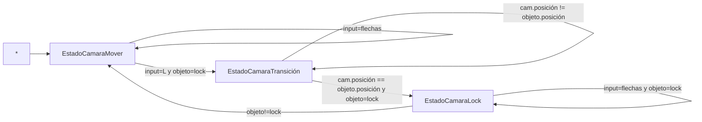

```mermaid
flowchart LR

    *--> EstadoCamaraMover 
    EstadoCamaraMover -->|input=flechas| EstadoCamaraMover
    EstadoCamaraMover -->|input=L y objeto=lock| EstadoCamaraTransición
    EstadoCamaraTransición -->|cam.posición != objeto.posición | EstadoCamaraTransición
    EstadoCamaraTransición -->|cam.posición == objeto.posición y objeto=lock| EstadoCamaraLock

    EstadoCamaraLock --> |objeto!=lock | EstadoCamaraMover
    EstadoCamaraLock -->|input=flechas y objeto=lock| EstadoCamaraLock

```
